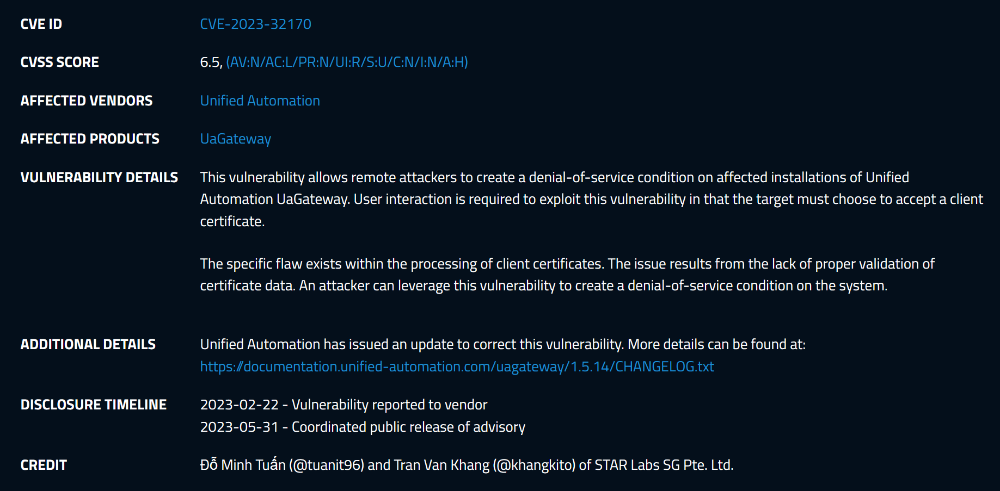

# CVE-2023-32170: Pre-auth DoS via infinite loop

<p align='center'>

</p>

## High-level overview
The vulnerability is an integer overflow that leads to an infinite loop while parsing the client provided certificate. Because there is only one thread that handles client connection, this infinite loop completely DoS the server. No client can connect and existing clients will timeout. You can also not stop the server, you have to kill the process.

<p align='center'>

</p>

## Root Cause Analysis
The bug gets triggered when sending the *Open Secure Channel* message when negotiating the connection. One of the field that the client needs to send is called *SenderCertificate* and is an ASN1 encoded certificate as I understand it. The bug is in the `uastack.dll` module which takes care of the transport. It doesn't have any application logic.

The bug is the function that tries to split up the certificate chain. I am no crypto / ASN1 expert but it basically walk the buffer and counts the number of certificate in the chain. It has the current position in the buffer, and the end pointer and loop until the remaining (dest - current position) is bigger than zero. Each certificate is supposed to start with a specific byte pattern (dictated by ASN1) that also has its size; this means the function can figure out the size, and increment the current position to skip to the next on the chain. Until eventually, the current position pointer hit the end of the buffer.

The bug happens in the logic that reads the byte pattern I mentioned above and the size of the current certificate. There is an integer overflow when computing its size which allows the size to be 0. If the size is 0, it means the current position pointer doesn't get incremented either and so doesn't make forward progress. This means it gets stuck in this loop forever, reading the same certificate and triggering the overflow forever.

Here is a C implementation of the logic:
```c++
unsigned int __cdecl ASN1Skip(unsigned __int8 **a_ppBuffer, int a_iBufferLength)
{
  // ...
  byOctet = (*a_ppBuffer)[1];
  if ( byOctet == 0x80 )
    return 0x803D0000;
  if ( (byOctet & 0x80) != 0 )
  {
    uiIndex = 2;
    uBytes = byOctet & 0x7F;
    if ( uBytes > 4 )
      return 0x80080000;
    if ( uBytes + 2 >= a_iBufferLength )
      return 0x80080000;
    while ( uiIndex < uBytes + 2 )
      uContentLength = (uContentLength << 8) | (*a_ppBuffer)[uiIndex++];
  }
  else
  {
    uContentLength = byOctet;
  }

  uContentLengtha = uContentLength + uBytes + 2; //!\ integer overflow here that allows us to set uContentLengtha to 0
  if ( uContentLengtha > a_iBufferLength )
    return 0x80080000;
  *a_ppBuffer += uContentLengtha; // This means the 'current position pointer' doesn't get incremented 
  return 0;
}
```

## PoC
See [CVE-2023-32170-preauth-infloop.py](CVE-2023-32170-preauth-infloop.py) but:
- Install `asyncua` with `pip3 install asyncua`
- Patch the `asyncua\common\connection.py` file with [connection.diff](connection.diff)
- Run the PoC against your target and you should see CPU usage jumping, and clients timing out
