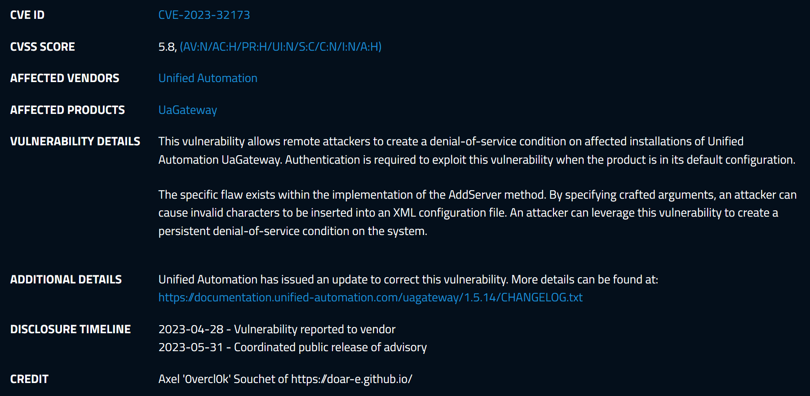
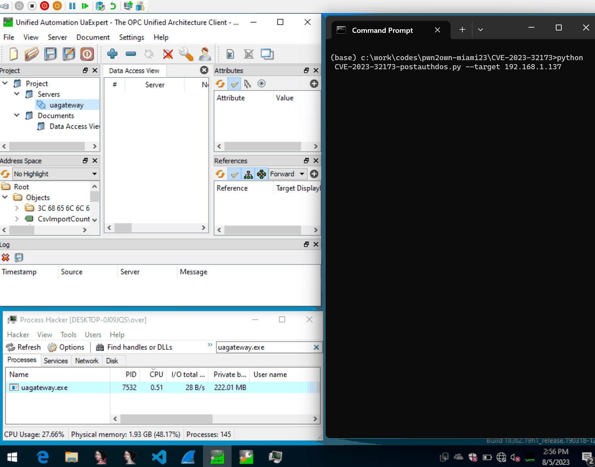

# CVE-2023-32173: AddServer XML Injection Denial-of-Service Vulnerability

<p align='center'>

</p>

## High-level overview
The vulnerability is an integer overflow that leads to an infinite loop while parsing the client provided certificate. Because there is only one thread that handles client connection, this infinite loop completely DoS the server. No client can connect and existing clients will timeout. You can also not stop the server, you have to kill the process.

<p align='center'>

</p>

## Root Cause Analysis
One of the procedure that is available to call as an anonymous is called `AddServer` and it allows a client to add a server to the gateway. The list of server is actually stored and persisted in an XML file that you can find in `C:\Program Files (x86)\UnifiedAutomation\UaGateway\bin\uagateway.config.xml`. After running the PoC, you can see the added server:
```xml
<OpcUaServer>
  <Name>&lt;hello my dude'"!#$%&amp;</Name>
  <Url>&lt;hello my dude'"!#$%&amp;</Url>
  <NamespacePrefixOption>ServerUri</NamespacePrefixOption>
  <SecurityPolicy>None</SecurityPolicy>
  <MessageSecurityMode>None</MessageSecurityMode>
  <UserTokenType>Anonymous</UserTokenType>
  <UserName/>
  <Password/>
  <UserCertificateFile/>
  <UserPrivateKeyFile/>
  <MaxOperationsPerServiceCall>0</MaxOperationsPerServiceCall>
  <ConnectTimeout>5000</ConnectTimeout>
  <WatchdogTime>5000</WatchdogTime>
  <WatchdogTimeout>5000</WatchdogTimeout>
  <ServiceTimeout>10000</ServiceTimeout>
  <ConnectFlag>true</ConnectFlag>
  <ForceSubscriptionEmulation>false</ForceSubscriptionEmulation>
  <DisableCertificateTimeCheck>false</DisableCertificateTimeCheck>
  <DisableCertificateRevocationCheck>false</DisableCertificateRevocationCheck>
  <DisableCertificateHostNameCheck>false</DisableCertificateHostNameCheck>
  <DisableApplicationUriCheck>false</DisableApplicationUriCheck>
  <DisableNonceLengthCheck>false</DisableNonceLengthCheck>
  <DisableEncryptedPasswordCheck>false</DisableEncryptedPasswordCheck>
  <DisableTrustedCertificateForUserTokenRequired>false</DisableTrustedCertificateForUserTokenRequired>
  <DisableSessionIdCheck>false</DisableSessionIdCheck>
  <DisableCertificateUsageCheck>false</DisableCertificateUsageCheck>
  <DisableBrowse>false</DisableBrowse>
  <DisableBrowseRoot>false</DisableBrowseRoot>
  <ReverseConnect>false</ReverseConnect>
  <ClientEndpointUrl/>
  <ServerCertificateName/>
</OpcUaServer>
```

If you try to reboot the server, it will never be able to start again. What happens is that when the server starts, it parses its XML configuration before setting itself up and the funky characters make the validation of the XML fail, so the server bails out:
```
22:45:36.462Z|1|109C* <-- ServerConfigXml::loadConfiguration [XmlError=PCDATA invalid Char value 2
 - line=137] - can not load XML configuration file
```

## PoC
See [CVE-2023-32173-postauthdos.py](CVE-2023-32173-postauthdos.py) but:
- Install `asyncua` with `pip3 install asyncua`
- Run the PoC against your target, then try to restart the server and it should fail
- The only way to fix the issue is to remove the `OpcUaServer` XML node off the config file
