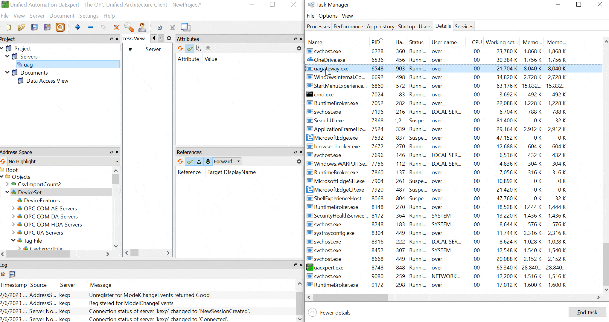
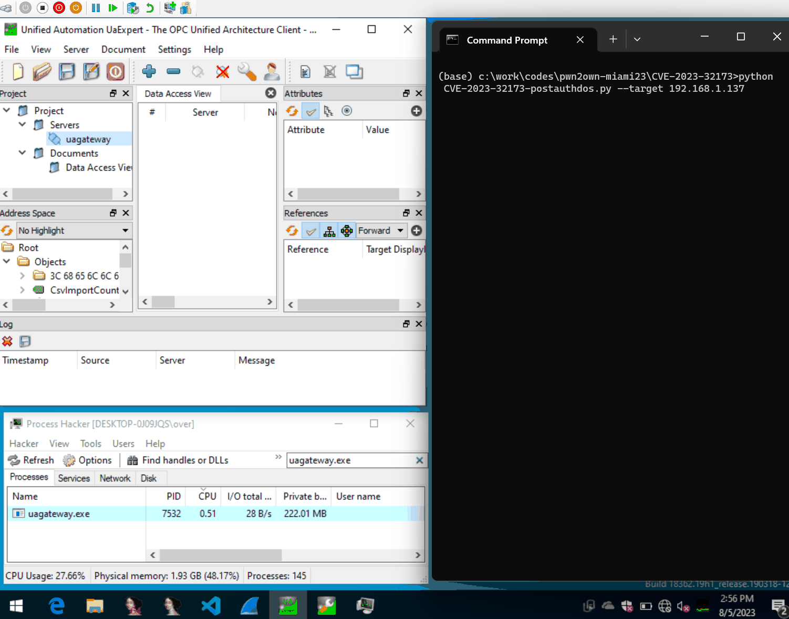
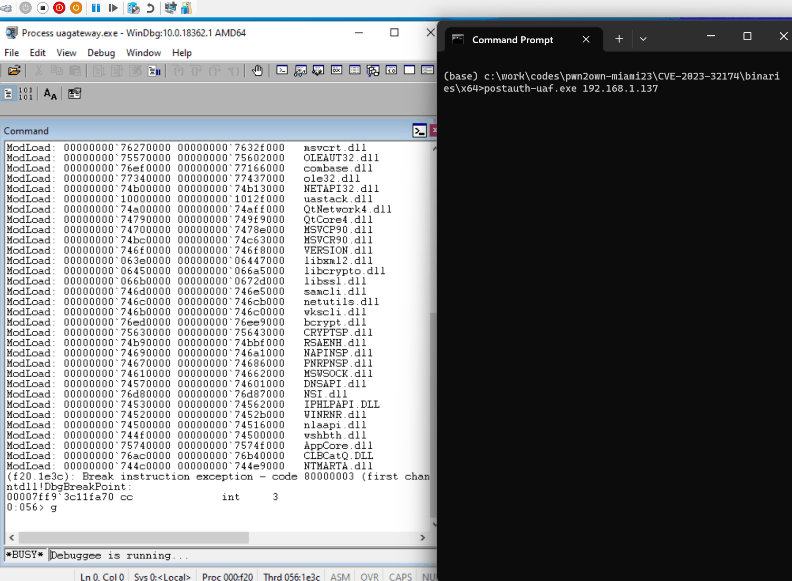

# Pwn2Own 2023 Miami - UaGateway OPC UA Server - use-after-free, permanent and non permanent DoSes
In this repository you will find PoCs for my Pwn2Own 2023 Miami entry as well as the other bugs that I found and reported to ZDI after the contest.

The [contest](https://www.zerodayinitiative.com/blog/2023/2/16/pwn2own-miami-2023-day-three-results) was held February 14th–16th, 2023, during the [S4 Conference](https://s4xevents.com/) in Miami, Florida and it was won by the [Claroty Research (Team82)](https://claroty.com/team82/research) folks 💪🏽.

All the bugs were affecting UaGateway v1.5.12 which was the latest version at the time of the contest. The bugs have been patched by the vendor since then, see the [CHANGELOG.txt](https://documentation.unified-automation.com/uagateway/1.5.14/CHANGELOG.txt).

I also wanted to thank the ZDI folks for running a great contest and rooting for participants 🙏🏽.

Thank you to the Unified Automation folks that tuned in during the contest to understand the issues and for fixing them ✊🏽.

## 🐛 Bugs

The bugs affected the [UaGateway OPC UA Server](https://www.unified-automation.com/downloads/opc-ua-servers.html) made by [Unified Automation](https://www.unified-automation.com/). Here's a few words about the product from the vendor's website:

> The UaGateway® is a product for migrating the "classic" COM/DCOM based OPC Servers to the new OPC Unified Architecture. The UaGateway is a high performance Wrapper/Proxy programmed in C++. The UaGateway is based on our C++ OPC UA Server/Client SDK/Toolkit. The UaGateway is a Windows 32Bit application; it can be installed on standard Windows (XP, Vista, Win7, Win8, Win10) and can also run on 64Bit Windows (WOW64). The UaGateway can connect multiple underlying COM DA Servers and multiple underlying UA Servers at the same time. Connections to underlying servers can be added during runtime without restarting the UaGateway.

Ultimately, it is a regular Windows WOW64 networking application that talks OPC UA. If you would like to try to reproduce the below issues, refer to [setup.md](setup.md) to configure the software in a suitable way for the Pwn2Own competition.

### 🐛 [CVE-2023-32170: Improper Input Validation Denial-of-Service Vulnerability (6.5CVSS)](CVE-2023-32170/README.md)

I reported this bug after the contest but it was marked as dupe. I later found that it was actually used during the contest by [@tuanit96](https://twitter.com/tuanit96) and [@khangkito](https://twitter.com/khangkito). The funny thing is that I chose to not use this bug during the contest as I was worried it was too shallow and that somebody else would use it; I guess I was right 🤭 This bug exploits an integer overflow to trigger an ~infinite loop. This is triggerable in default configuration and before authentication.

### 🐜 [CVE-2023-32171: Null Pointer Dereference Denial-of-Service Vulnerability (6.5CVSS)](CVE-2023-32171/README.md)

This is the entry that [I successfully demonstrated at the contest](https://www.youtube.com/watch?v=_OGFlgyAzIE&t=83s). I decided to pick this bug as it looked less shallow and wanted to try to minimize the risk of another team using the same bug than me. This is triggerable in default configuration after authentication (anonymous account is enough). This bug was discovered with [wtf](https://github.com/0vercl0k/wtf).

### 🪲 [CVE-2023-32173: AddServer XML Injection Denial-of-Service Vulnerability (5.8CVSS)](CVE-2023-32173/README.md)

This bug allows to insert invalid characters inside a configuration XML file that is parsed when the UAGateway starts. This file is parsed every time the service starts and those invalid characters make the parsing fail which prevent the service from starting. This lead to a permanent DoS and is triggerable in default configuration after authentication (anonymous is enough).

### 🪳 [CVE-2023-32174: NodeManagerOpcUa Use-After-Free Remote Code Execution Vulnerability (9.1CVSS)](CVE-2023-32174/README.md)

This is a race condition that leads to a use-after-free. I didn't attempt to exploit this vulnerability for the contest as I was running out of time. This is triggerable in default configuration after authentication (anonymous account is enough).

