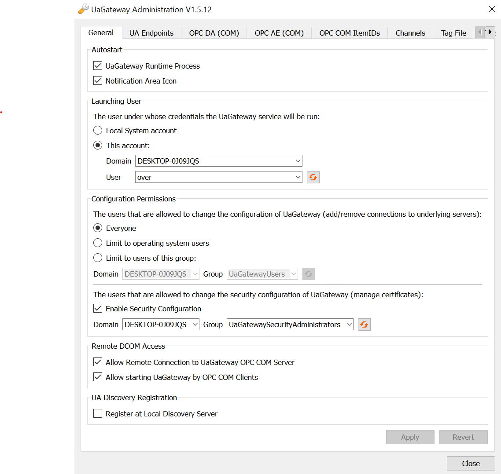
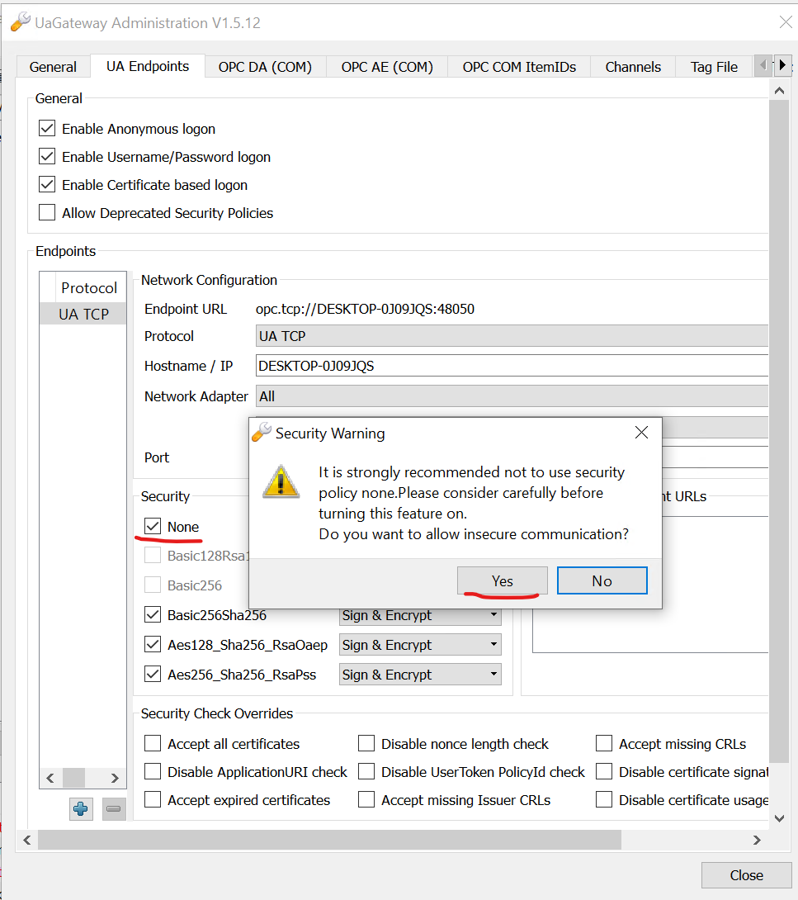

# Setting up the target
- Download the software from Unified Automations' website: [uagateway-win32-x86-vs2008sp1-v1.5.12-482.zip](https://www.unified-automation.com/fileadmin/files/server/uagateway-win32-x86-vs2008sp1-v1.5.12-482.zip)
- Run the installer, leave every default options (OPC UA Port 48050), click next until finished
- The *Initial UaGateway Setup* window should appear; don't modify anything in the *General* pane. Click on the *UA Endpoints* pane, and make sure to check *None* in *Security* for the first endpoint to disable encryption. **Note that this is not required for the bug to reachable**.

- Close the window
- Right click on the icon in the taskbar, and click start to kick off the server
- Verify connectivity with a client like [UaExpert](https://www.unified-automation.com/products/development-tools/uaexpert.html). Click *Server* > *Add*, give it a name, click on the *Advanced* pane, enter the *Endpoint Url* in *Server Information* as: `opc.tcp://localhost:48050` (replace *localhost* by the IP of the server). Hit *OK*, right click on the added server and click *Connect*
